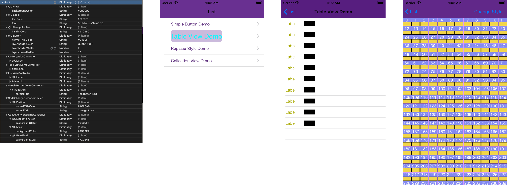
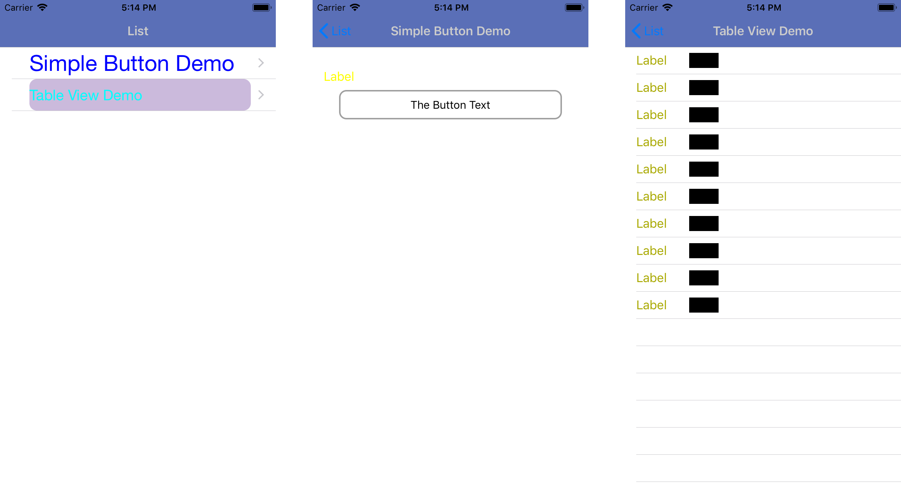
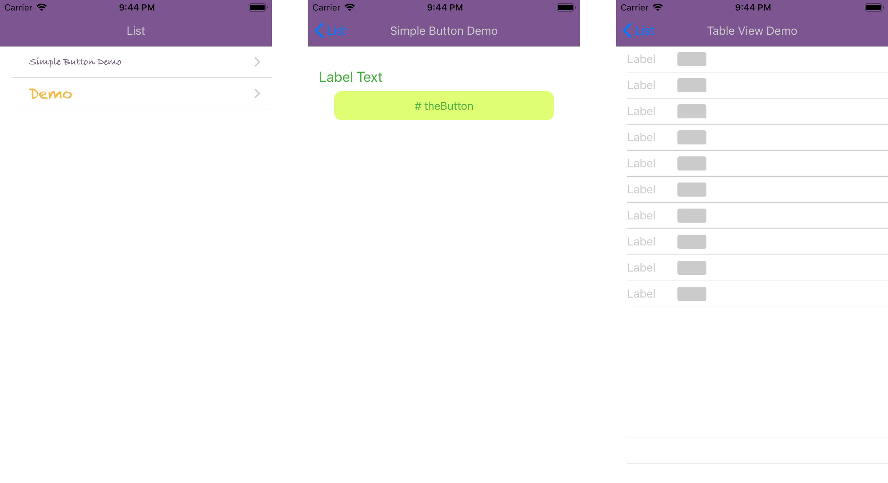

# A Style Injection Framework

**A Style Injection** provide the injection way to customize whole iOS application base on the single configuration file without extra coding.


## Style Sheet Format and Rules

In the style map, style item are follow below rules:

1. **Multilayer style map**:
   - First layer can be either the class name of UIViewController or Type/Name style set  
   - Second layer cannot be the class name of UIViewController, only can be the name of Type/Name style set
   - When the first layer is the class name of UIViewController, that means all the children style set are apply under this UIViewController
   - When the first layer is the type/name style set, which means the style set will apply globally with lower priority

2. **Type style set**:  
   - When the key start with special character `@` means apple the style setting to the type of controls
   - For instance, `@UILabel` means the style set apply to all the `@UILabel` under that level

3. **Name style set**:  
   - When the key start with special character `#` means apple the style setting to the controls with the styleIdentifier
   - For instance, `#demoLabel` means the style set apple to all UIViews with the styleIdentifier named `#demoLabel`  

4. **Value of style set**:  
   - Style set should be dictionary, key is property name of the control; and the value is the value of the property
   
   - The key as property can be class/structure, and in some case need to set the property to the sub-property; we can using `(dot .)` in this case:
     + For Example, apply these two style setting to set the view to be rounded corners; 
     ```
     layer.cornerRadius : 10
     clipsToBounds : true
     ```
   
   - In the plist, the value type is limited, the StyleInjection libaray provide format to allow convert string to different type of value, the full list in "[style set value format](#style_set_value_format)" section, below is some example:
     + Color: it must start with `#` and come along with 6 digit, e.g. `#A0A0A0`  
     + Font: it must start with `$` come along with `""` has Font name init, then `:` with size of Font, e.g. `$"Helvetica Neue":17`


## Usage Examples:

#### Basic usage:

Create file named **StyleSheet.plist** to the project as below, no code needed, the style all automatically apply to all controllers.

**Style configuration**



**Runtime results**



#### Load from specified style file

For example, load `StyleSheet_2.plist` as style source:

```swift
A_StyleManager.shared().setupStyleSourceRepository(StylePlistProvider("StyleSheet_2"))
```

```objc
[[A_InjuectionManager shared] setupStyleSourceRepository:
      [[StylePlistProvider alloc] init:@"StyleSheet_2"]];
```

**StyleSheet_2 configuration**


**Runtime Results:**



#### Apple new style:
In the middle of app is running, style can changed by updated `StyleSourceRepository`. However, the style already applied won't be traceback change, in this case, `applyStyle` function can force window update.

```swift
A_StyleManager.shared.applyStyle()
```
```objc
[[A_StyleManager shared] applyStyle];
```


## Installation
Cocoa Pod install:
```
  pod 'A_StyleInjection'
```


## Format of Style value

| Type  | Format                   | Example                | Desc |
| ----- | ------------------------ | ---------------------- | ---- |
| **Color** | \# with 6 digit          | `#A0A0A0`             | Create UICOlor |
| **CGColor** | CG\# with 6 digit | `#A0A0A0` | Create CGColorRef |
| **Font** | $" Font name ":Font Size | `$"Helvetica Neue":17` | Create Font |


## UIKit Extension Property

#### UIButton
| Property                   | Mapped Original Function       |
| ------------------------ | ---------------------- |
| **normalTitle** | `titleForState:Normal`             |
| **highlightedTitle** | `titleForState:Highlighted` |
| **disabledTitle** | `titleForState:Disabled` |
| **selectedTitle** | `titleForState:Selected` |
| **normalTitleColor** | `titleColorForState:Normal` |
| **highlightedTitleColor** | `titleColorForState:Highlighted` |
| **disabledTitleColor** | `titleColorForState:Disabled` |
| **selectedTitleColor** | `titleColorForState:Selected` |


